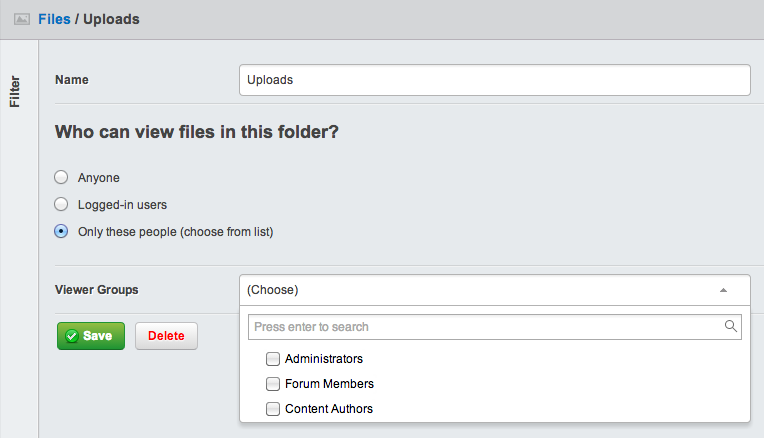
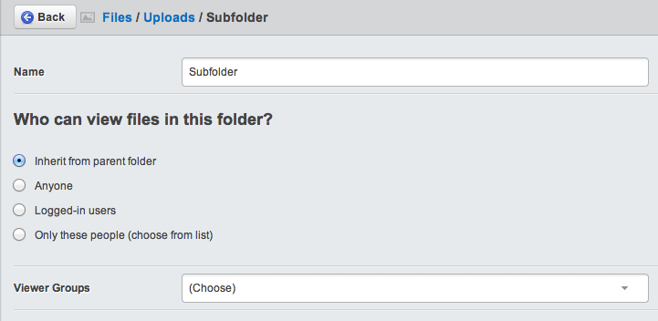

## Introduction

The secure assets module can be used to apply read and write permissions to
the filesystem on a folder by folder basis.

## Assigning permissions

To edit permissions for a folder go to the Files section of the cms and select
the edit icon beside the folder to apply permissions to. The root 'assets'
folder itself may not be given permissions directly, so only store restricted
content in a secure subfolder instead.

### Default Folder Permissions

The following permissions are available for every folder:

 * `Anyone` - All read - write access is allowed. This is the default value.
 * `Logged-in users` - Only registered users
 * `Only these people` - Allows specific groups to be selected

### Subfolders

For folders at the third level or deeper (e.g. assets/Uploads/Subfolder)
the default value is instead `Inherit`, which will use the same
permissions as the folder above.

As a matter of best practice it is advisable to avoid giving a folder
less restrictive permissions than the one above, as users may find
it difficult to access in the CMS.

### Files

Files will inherit the permissions of the folder they are placed in, but
may not have permissions assigned directly. This is due to the restriction
on permissions being placed on a per-folder level.

It is also important to take note when using secure files attached to
DataObjects which other users may be able to edit. If that user does
not have permission to view the file attached, then it will not appear
against that object, and modification may result in it being detached.

Try to avoid attaching images or other files to DataObjects which may 
be publicly viewed, to avoid unnecessary access denied errors appearing.

## Other Considerations

Securing files will cause extra load on your webserver and your database,
as the framework will check the datatabase for access permissions, and pass the
file data through the framework when it is output to the user.

It's also important to make sure that any .htaccess or web.config file
under assets is made writable by the webserver, as this module will
modify it as necessary to apply custom permissions.
